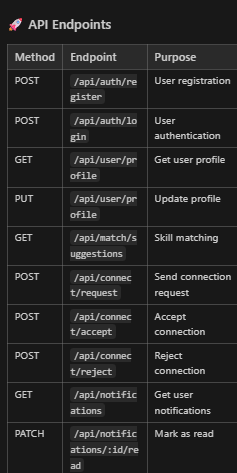

┌─────────────────┐    ┌─────────────────┐
│   Client App   │    │   Server API    │
│  (Next.js)    │    │  (Express.js)  │
└─────────────────┘    └─────────────────┘
         │                       │
         │              ┌─────────────────┐
         └──────────────│   Socket.io     │
                        │  (Real-time)   │
                        └─────────────────┘
         │                       │
         │              ┌─────────────────┐
         └──────────────│  MongoDB       │
                        │  (Database)    │
                        └─────────────────┘

server/
├── src/
│   ├── server.js              # Main server entry point
│   ├── config/
│   │   └── db.js            # MongoDB connection
│   ├── models/
│   │   ├── User.js            # User schema with connections array
│   │   ├── Notification.js    # Notification schema
│   │   └── ConnectionRequest.js # Connection request schema
│   ├── controllers/
│   │   ├── auth.controller.js     # Login/Register with JWT
│   │   ├── user.controller.js     # Profile management
│   │   ├── match.controller.js     # Skill matching
│   │   ├── connect.controller.js   # Send connection requests
│   │   ├── connection.controller.js # Accept/Reject requests
│   │   └── notification.controller.js # Fetch/Mark read notifications
│   ├── routes/
│   │   ├── auth.routes.js         # Auth endpoints
│   │   ├── user.routes.js         # Profile endpoints
│   │   ├── match.routes.js         # Matching endpoints
│   │   ├── connect.routes.js       # Connection endpoints
│   │   └── notification.routes.js # Notification endpoints
│   ├── middleware/
│   │   └── auth.middleware.js     # JWT verification
│   └── socket/
│       └── socket.js             # Real-time socket events
├── .env                       # Environment variables
└── package.json

1. User A clicks "Connect"
   ↓
2. POST /api/connect/request
   ↓
3. Create ConnectionRequest + Notification
   ↓
4. Check if User B is online
   ├─ Yes: Emit socket notification
   └─ No: Store in database only
   ↓
5. User B receives:
   ├─ Real-time toast (if online)
   ├─ Badge update (unread count)
   └─ Database entry (persistent)

   

   Method	Endpoint	Purpose
POST	/api/auth/register	User registration
POST	/api/auth/login	User authentication
GET	/api/user/profile	Get user profile
PUT	/api/user/profile	Update profile
GET	/api/match/suggestions	Skill matching
POST	/api/connect/request	Send connection request
POST	/api/connect/accept	Accept connection
POST	/api/connect/reject	Reject connection
GET	/api/notifications	Get user notifications
PATCH	/api/notifications/:id/read	Mark as read
